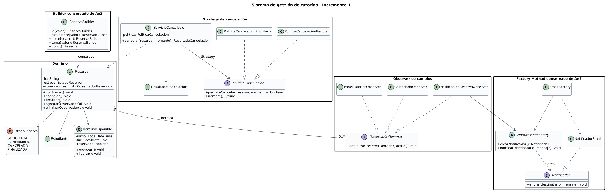

# Sistema de gestión de tutorías

Incremento 1 del proyecto integrador de Diseño de Software. El proyecto evoluciona la base de Ae1 de esta cuenta e integra Builder y Factory Method de la solución anterior como preparación para Ae3. En Ae3 incorpora Strategy y Observer para resolver dos puntos de variación reales: las políticas de cancelación y las reacciones de varios componentes ante un cambio de estado.

## Alcance del incremento

Tras preparar la base con Builder y Factory Method, el proyecto permite construir reservas, confirmar, cancelar y finalizar, además de crear canales de notificación. Sin embargo, una única regla de cancelación obligaría a modificar el servicio cada vez que apareciera otra política. También existía acoplamiento si `Reserva` llamaba directamente al correo, calendario y panel cada vez que cambiaba su estado.

El incremento resuelve estos problemas sin reemplazar los patrones de Ae2:

- **Strategy:** encapsula la política regular y la prioritaria detrás de `PoliticaCancelacion`.
- **Observer:** permite que correo, calendario y panel reaccionen a cambios de estado sin quedar incorporados dentro de `Reserva`.
- **Builder:** continúa controlando la construcción legible de `Reserva`.
- **Factory Method:** continúa seleccionando el canal concreto de notificación.

## Componentes principales

| Componente | Responsabilidad |
|---|---|
| `Reserva` | Protege su ciclo de vida y publica cambios de estado. |
| `ReservaBuilder` | Construye reservas y valida los datos obligatorios. |
| `PoliticaCancelacion` | Define el contrato estable de una regla de cancelación. |
| `ServicioCancelacion` | Ejecuta la política inyectada y cancela cuando corresponde. |
| `ObservadorReserva` | Define la reacción ante un cambio de estado. |
| `CalendarioObserver` | Registra actualizaciones del calendario. |
| `PanelTutoriasObserver` | Registra actualizaciones del panel. |
| `NotificacionReservaObserver` | Delega el aviso al Factory Method de notificación. |

## Reglas demostradas

- La política regular requiere al menos 2 horas de anticipación.
- La política prioritaria requiere al menos 30 minutos.
- Solo las reservas `SOLICITADA` o `CONFIRMADA` pueden cancelarse.
- Cada cambio de estado se publica a los observadores registrados.

## Principios de diseño

- **SRP:** la selección de reglas, la construcción y las reacciones externas están en clases separadas.
- **OCP:** una nueva política u observador se agrega mediante otra implementación, sin modificar `ServicioCancelacion` ni los observadores existentes.
- **DIP:** `ServicioCancelacion` depende de `PoliticaCancelacion` y `Reserva` depende de `ObservadorReserva`, no de implementaciones concretas.
- **Cohesión y acoplamiento:** cada paquete agrupa una responsabilidad y las dependencias entre paquetes pasan por contratos explícitos.

## UML actualizado



El archivo fuente editable está en [`docs/uml-incremento1.puml`](docs/uml-incremento1.puml).

## Estructura

```text
sistema-tutorias-ae3/
├── docs/
│   ├── uml-incremento1.puml
│   └── uml-incremento1.png
├── src/main/java/edu/uees/tutorias/
│   ├── builder/
│   ├── cancelacion/
│   ├── domain/
│   ├── notificacion/
│   └── observer/
├── src/test/java/edu/uees/tutorias/
├── pom.xml
└── README.md
```

## Requisitos

- Java 17
- Maven 3.9 o superior

## Compilar y verificar

```bash
mvn clean compile
mvn clean test
mvn exec:java
```

Resultado verificado: 8 pruebas ejecutadas, 0 fallos y 0 errores.

La demostración imprime los cambios de estado enviados por correo, el resultado de ambas políticas y la cantidad de eventos recibidos por calendario y panel.

## Etapas del incremento

```text
refactor: preparar base de Ae3 con Builder y Factory Method
feat: aplicar strategy a politicas de cancelacion
feat: notificar cambios de reserva con observer
feat: integrar patrones en flujo de demostracion
docs: agregar UML del incremento 1
docs: actualizar README y decisiones de diseño
```

## Repositorio

https://github.com/Santzz12/Sistema-Tutorias

## Uso de inteligencia artificial

Se utilizó inteligencia artificial como apoyo para estructurar el incremento, revisar la coherencia entre UML y Java, proponer casos de prueba y mejorar la documentación. El código fue compilado y probado, y el estudiante debe revisar y comprender cada decisión antes de la entrega.

## Continuidad y limitaciones

La migración desde la base real de esta cuenta está documentada en [continuidad-ae3.md](docs/continuidad-ae3.md). Las notificaciones se simulan en consola y calendario/panel guardan eventos en memoria. Los clientes deben cancelar mediante `ServicioCancelacion` para aplicar la política. Observer es síncrono y no incorpora reintentos ni aislamiento de fallos.

## Evidencias de ejecución

Los [resultados por etapa](docs/evidencias/) contienen extractos reales de Maven y de la demostración. La suite termina con 8 pruebas, 0 fallos y 0 errores. Se incluyen vistas ampliadas de [Strategy](docs/uml-strategy.png) y [Observer](docs/uml-observer.png), con fuentes PlantUML editables.
